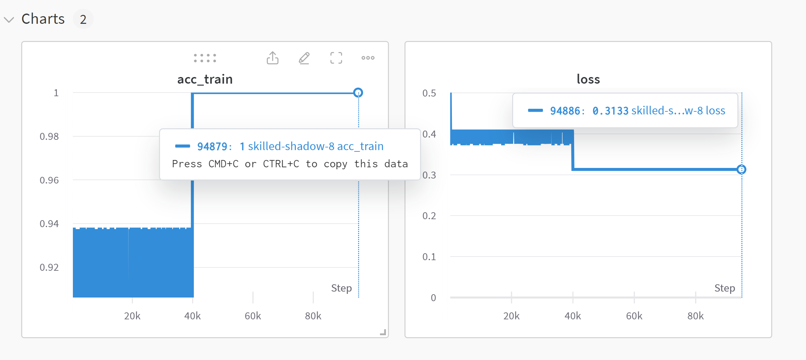
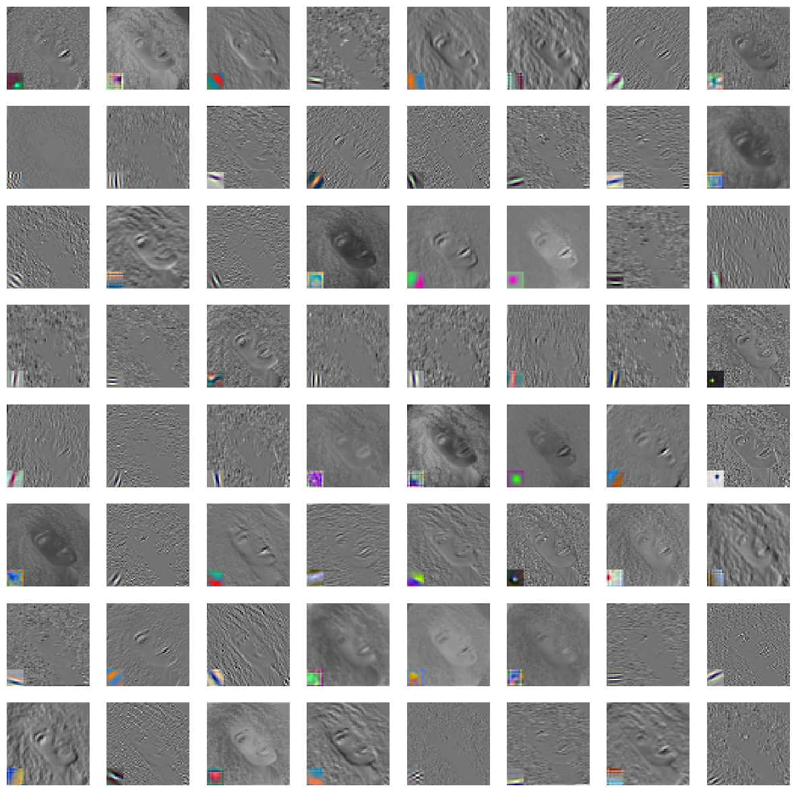

# Hair-Texture-Identifier

Harness the latest advancements in artificial intelligence to precisely distinguish between curly and straight hair, revolutionizing the way you discover hair care products tailored to your unique hair texture.

## Problem
The distinctions between curly and straight hair extend beyond mere aesthetics, delving into a realm of unique challenges and considerations, particularly within the beauty and personal care industry. Haircare companies tailor their products to cater to different hair types, addressing issues such as frizz, dryness, and styling preferences. Salons may specialize in serving clients with specific hair types, creating niche business opportunities. The manufacturing of hair tools and appliances also takes into account the diverse needs of individuals with curly or straight hair. Representation and inclusivity in marketing campaigns and partnerships with influencers play a crucial role in reflecting the diversity of the customer base.

In contrast, the inherent differences between curly and straight hair can pose challenges. Curly hair often demands more maintenance and is susceptible to frizz and breakage, while straight hair may lack natural volume. AI systems in e-commerce and search engines can face issues related to data bias, limited contextual understanding, and inadequate image recognition, potentially leading to inaccurate recommendations for hair products. Addressing these challenges requires improvements in AI training data, more inclusive datasets, and enhanced algorithms capable of distinguishing between various hair types. As technology evolves, efforts to reduce bias and enhance the recognition of diverse hair textures are essential for providing fair and effective user experiences in the beauty and personal care industry.

## Solution

Using google colab I implemented these types of code: 
Loading Labels and Pre-trained Model: It loads labels for the model's classes and initializes a pre-trained AlexNet model.

Downloading Google Slides Images: It fetches images from a Google Slides presentation by first downloading the presentation as a PDF and then converting PDF pages to images.

Data Preprocessing: The images are preprocessed, resized, and normalized to prepare them for input to the model.

Model Inference: It uses the pre-trained AlexNet model to make predictions on the processed images.

Classification Results: The code determines the model's predictions and prints the corresponding labels for each image. It also appears to be setting up some binary classification data, but it's unclear how it's being used in the context of the code.

Data Conversion and Preparation: The code sets up some data arrays and reshapes them for further processing.

Defining Loss Functions: The code defines a softmax function and a cross-entropy loss function.

Random Number Generation: It defines functions for generating random numbers and truncated normal random numbers.

Training Loop: A training loop is initiated with a set number of epochs. Within each epoch, a batch of training data is fetched. The cross-entropy loss is computed and backpropagation is performed to update the model's weights. The loss and other metrics are logged using Weights and Biases (wandb).

Initialization and Configuration: It initializes the Weights and Biases project and sets various configuration parameters such as learning rate, batch size, and the number of training epochs.

Optimization and Logging: The code enters the training loop, where the model is updated using the Adam optimizer, and loss and accuracy metrics are logged.

Visualization of Model Parameters: The code visualizes the weights of the first convolutional layer (w0) and plots them along with feature maps, providing insights into the learned filters.

Feature Extraction: Convolutional and pooling layers are applied to the image, generating feature maps at different stages of the model.

Fully Connected Layers: The code processes the feature maps through fully connected layers, performing linear transformations and ReLU activations.

Classification Result: The final classification result is obtained by determining the output neuron with the highest activation in the last fully connected layer.

Visualization of Feature Maps and Filters: The code includes functions to visualize feature maps with overlaid filters, providing a deeper understanding of the model's internal representations.

## Weights and Biases Results

## Data Deck
[Data_Deck](https://docs.google.com/presentation/d/1mATs77DNphkXvP1BRh-J_wFg3ptQ-K5wyM0xJHjR4pk/edit?usp=sharing)

## Data Deck loaded in Alexnet
[Data Deck in Alexnet](https://colab.research.google.com/drive/1h5G64TCkruibmEOqh0kwUp_-pb3AKZp4?usp=sharing)

## Linear Model Training with PyTorch and WandB
[Alexnet](https://colab.research.google.com/drive/1SQi159ufFoVHudDnTQ88ZHq3FO5FNqbU?usp=sharing)

## Filters and Feature Maps

[Filters and Feature Maps](https://colab.research.google.com/drive/1QrXVnk21dBjcx8biWkUlDiwdGKvVR9Ex?usp=sharing)
